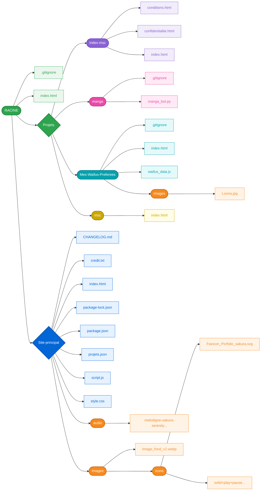

# 🌸 Nathan LACROIX | Portfolio - Sakura & Glassmorphism

[](https://developer.mozilla.org/fr/docs/Web/JavaScript)
[](https://github.com/conventional-changelog/standard-version)
[](https://css-tricks.com/glassmorphism-css/)

Bienvenue sur le dépôt officiel de mon portfolio principal. Cet espace présente un univers visuel épuré, transparent et poétique inspiré des cerisiers en fleurs (Sakura), tout en regroupant mes projets de développement web, d'applications et de scripts. 

---

## 🗂️ Sommaire

- [1. 🗺️ Architecture & Flux du Projet](#1-️-architecture--flux-du-projet)
- [2. 🌟 Fonctionnalités Clés](#2--fonctionnalites-cles)
- [3. 🔐 Sécurité & Intégrité du Code](#3--securite--integrite-du-code)
- [4. 🛠️ Stack Technique & Écosystème](#4--stack-technique--ecosysteme)
- [5. 🚀 Projets Présentés](#5--projets-presentes)
- [6. 🚀 Lancement Local](#6--lancement-local)
- [7. 🤝 Contributions](#7--contributions)
- [8. 🎵 Crédits & Remerciements](#8--credits--remerciements)
- [9. 📬 Me Contacter / Renseignements](#9--me-contacter--renseignements)

---

## 1. 🗺️ Architecture & Flux du Projet 

Voici l'organisation de l'écosystème de mes projets et de la structure globale. 

<details>
<summary><b>📐 Cliquez ici pour afficher/masquer le diagramme d'architecture complet (Mermaid)</b></summary>
<br>


</details>

### 📁 Aperçu rapide des dossiers principaux

| Emplacement | Rôle |
| --- | --- |
| `Site-principal/` | Contient le cœur du portfolio (styles glassmorphism, scripts audio et animation canvas). |
| `Projets/manga/` | Script Python complet pour le fonctionnement de votre **Manga Bot Discord**. |
| `Projets/index-msc/` | Page d'atterrissage, CGU et politiques de confidentialité de la Visionneuse Manga. |
| `Projets/Mes-Waifus-Preferees/` | Mini-application web interactive listant des personnages avec données stockées. |

>[hint] 💡 **À propos du design :** L'interface repose sur un effet *Glassmorphism* poussé (transparence, floutage d'arrière-plan avec `backdrop-filter`) combiné à une animation fluide de pluie de pétales de Sakura gérée via l'API Canvas de HTML5.

---

## 2. 🌟 Fonctionnalités Clés

* **🌸 Pluie de Sakura Interactive :** Un script d'arrière-plan ultra-léger via Canvas (`script.js`) pour animer des pétales avec vélocité et rotations aléatoires.
* **🎵 Ambiance Sonore Intégrée :** Un lecteur audio discret jouant *Sakura Serenity* avec un système de notifications dynamiques (*Music Toast*) pour avertir l'utilisateur lors de la lecture/pause.
* **📂 Grille de Projets Dynamique :** Chargement asynchrone des projets et des métadonnées via un fichier structuré `projets.json`.
* **📈 Suivi d'Audience Privacy-Friendly :** Intégration de GoatCounter pour l'analyse anonyme du trafic sans tracking intrusif.

---

## 3. 🔐 Sécurité & Intégrité du Code

Pour éviter toute tentative d'usurpation d'identité, de falsification (commits frauduleux à mon nom) ou de contributions malveillantes visant à tromper les utilisateurs, ce dépôt applique des règles strictes :

* **🛡️ Commits Signés obligatoires :** Tous mes commits officiels sont signés numériquement avec une clé GPG/SSH cryptographique. Si un commit ne possède pas le badge **"Verified"** sur GitHub, il ne provient pas de moi.
* **🚫 Protection de la branche principale :** La branche `main` (ou `master`) est verrouillée. Aucun push direct n'est autorisé sans vérification et validation des statuts de sécurité.
* **⚠️ Alerte Sécurité :** N'exécutez jamais de scripts provenant de forks non vérifiés de ce projet. Seul le code présent sur ce dépôt officiel (`Nathan-Pro-FR`) est audité et garanti sûr.

---

## 4. 🛠️ Stack Technique & Écosystème

### Technologies Principales

### 📦 Gestion des Dépendances & Écosystème Interne

Pour maintenir ce projet propre et suivre les conventions de commits, j'utilise une dépendance de développement principale qui installe tout un écosystème en cascade.

#### 🔹 Dépendance directe (`devDependencies`)

* **`standard-version` (^9.5.0)** : Automatisation des numéros de version (SemVer) et génération automatique du fichier `CHANGELOG.md`.

#### 🔹 Sous-dépendances clés installées en arrière-plan

Pour comprendre la mécanique complète installée par `standard-version` dans le dossier `node_modules`, voici les sous-dépendances clés requises :

* **Analyse Git & Commits Standards :** `conventional-changelog` (moteur d'analyse des commits selon la convention Angular/Conventional Commits), `git-raw-commits`, `git-semver-tags`.
* **Moteur de templates & parsing :** `handlebars` (pour la mise en page du changelog), `conventional-commits-parser`, `JSONStream`.
* **Outils CLI & Style Terminal :** `yargs` (gestion des arguments de ligne de commande), `chalk` (colorisation des logs de release).

---

## 5. 🚀 Projets Présentés

Gérés dynamiquement depuis `projets.json` :

1. **🌸 Mes Waifus Préférées :** Application interactive listant mes personnages favoris avec visuels dédiés.
2. **📚 Manga Sakura Collector (Application) :** Scanneur et gestionnaire de collection de mangas connecté sur l'API *Google Books*.
3. **🤖 Manga Bot (Discord) :** Un bot Python intelligent codé pour archiver et suivre ses mangas directement sur Discord.
4. **🖥️ Visionneuse Manga Sakura :** Page web dédiée à la lecture du fichier `.json` extrait par le bot Discord (incluant CGU et politiques de confidentialité).

---

## 6. 🚀 Lancement Local

1. **Cloner le projet :**

```bash
git clone [https://github.com/Nathan-Pro-FR/Porftolio_Nathan.git](https://github.com/Nathan-Pro-FR/Porftolio_Nathan.git)
cd Porftolio_Nathan

```

2. **Installer l'environnement de release (Optionnel) :**

```bash
npm install

```

3. **Générer une nouvelle version (Outils développeur) :**

```bash
npm run release

```

---

## 🤝 Contributions

Les contributions, signalements de bugs ou suggestions d'amélioration sont les bienvenus ! Néanmoins, pour des raisons de clarté et de sécurité :

1. Ouvrez d'abord une **Issue** pour discuter du changement que vous souhaitez apporter.
2. Évitez les Pull Requests directes sur la branche `main` sans discussion préalable.
3. Respectez le format de message des [Conventional Commits]() lors de vos propositions.

---

## 🎵 Crédits & Remerciements

Un grand merci aux créateurs des ressources en libre accès utilisées pour ce projet :

* **Composition Musicale :** *Sakura Serenity* par **Melodigne** (via Pixabay Music).
* **Design & Graphismes :** Set d'icônes *Solid Play Pause* par **Heroicons** (Licence MIT).
* **Optimisations :** Compressions d'images via *Squoosh* et formats audio optimisés.

---

## 📬 Me Contacter / Renseignements

Si vous avez besoin d'informations, de précisions ou si vous souhaitez échanger sur le projet, je suis joignable directement sur mes plateformes prioritaires :

* **💬 Discord :** [@Nathanfurry_lax]()
* **✈️ Telegram :** [@Nathanfurry_lax]()

---
